# AI Interview Agent 🤖

[](https://python.org)
[](https://streamlit.io)
[](https://langchain.com)
[](https://ai.google.dev)

An intelligent AI-powered interview system that analyzes candidate resumes against job descriptions and conducts personalized, interactive interviews using Google's Gemini AI and LangGraph workflow orchestration.

## 🚀 Features

### 📊 **Intelligent Analysis**
- **Resume-JD Compatibility Analysis**: Evaluates alignment between candidate background and job requirements
- **Skills Gap Identification**: Identifies missing skills and extra strengths
- **Experience Matching**: Analyzes relevant experience and domain expertise
- **PDF Processing**: Automatically extracts text from resume and job description PDFs

### 🎯 **Dynamic Question Generation**
- **Technical Questions**: Based on candidate's technical background and job requirements
- **Behavioral Questions**: STAR method-based questions focusing on soft skills and leadership
- **Situational Questions**: Scenario-based problem-solving challenges
- **Context-Aware**: Questions tailored to candidate's specific experience and role

### 💬 **Interactive Interview Experience**
- **Conversational Interface**: Natural, AI-driven interview conversations
- **Follow-up Questions**: Dynamic questioning based on candidate responses
- **Real-time Evaluation**: Continuous assessment during the interview
- **Multi-modal Interface**: Both web-based (Streamlit) and command-line options

### 📈 **Comprehensive Evaluation**
- **Response Analysis**: AI-powered evaluation of candidate answers
- **Depth Assessment**: Measures the depth and quality of responses
- **Interview Summary**: Detailed evaluation report with recommendations
- **JSON Export**: Structured data export for further analysis

## 🏗️ Architecture

### **Workflow Structure**
```
📁 AI-Interview-Agent/
├── 🎯 main.py                      # Command-line entry point
├── 🌐 streamlit_app.py             # Web interface 
├── 🏃 run_streamlit.py             # Streamlit launcher script
├── 🧠 llm.py                       # Google Gemini AI integration
├── 🔄 graph.py                     # LangGraph workflow orchestration
├── 📋 requirements.txt             # Python dependencies
├── 📁 tools/                       # Core processing modules
│   ├── 🔍 analyzer.py              # Resume-JD compatibility analysis
│   ├── 📊 context_splitter.py      # Context categorization engine
│   ├── ❓ question_generator.py    # Interview question generation
│   └── 💬 interview_conversational_agent.py # Interactive interview conductor
├── 📁 resources/                   # Sample documents
│   ├── 📄 cv-ml.pdf               # Sample resume
│   └── 📄 JD-ml.pdf               # Sample job description
└── 📖 README.md                    # This documentation
```

### **Processing Pipeline**

```mermaid
graph TD
    A[📄 PDF Resume] --> B[📋 To Markdown ]
    C[📄 PDF Job Description] --> B
    B --> D[🔍 Resume-JD Analysis]
    D --> E[📊 Context Splitting]
    E --> F[❓ Question Generation]
    F --> G[💬 Interactive Interview]
    G --> H[📈 Response Evaluation]
    H --> I[📊 Final Assessment]
```


## ⚙️ Installation

### **Prerequisites**
- Python 
- Google API key for Gemini AI

### **Setup Steps**

1. **Clone the repository**
   ```bash
   git clone https://github.com/gopalkrishna2004/AI-Interview-Agent.git
   cd AI-Interview-Agent
   ```

2. **Install dependencies**
   ```bash
   pip install -r requirements.txt
   ```

3. **Configure API Key**
   
   Edit `llm.py` and replace the placeholder:
   ```python
   os.environ["GOOGLE_API_KEY"] = "your-actual-api-key-here"
   ```
   
   Or set as environment variable:
   ```bash
   export GOOGLE_API_KEY="your-actual-api-key-here"
   ```

4. **Verify installation**
   ```bash
   python run_streamlit.py
   ```

## 🎮 Usage

### **Option 1: Web Interface (Recommended)**

Launch the Streamlit web application:
```bash
python run_streamlit.py
```

Then open your browser to `http://localhost:8501`

**Features:**
- 📤 **File Upload**: Upload resume and job description PDFs
- 🎨 **Modern UI**: Clean, professional interface
- 📊 **Visual Results**: Interactive display of analysis and questions
- 💬 **Live Chat**: Real-time interview conversation
- 📱 **Responsive Design**: Works on desktop and mobile

### **Option 2: Command Line**

For programmatic usage or testing:
```bash
python main.py
```

**Note**: Update the file paths in `main.py`:
```python
resume_pdf_path = "path/to/your/resume.pdf"
jd_pdf_path = "path/to/your/job_description.pdf"
```

## 🔧 Core Components

### **1. LLM Integration (`llm.py`)**
- **Google Gemini 2.5 Flash**: High-performance AI model integration
- **Standardized Interface**: Consistent AI interaction across all modules
- **Error Handling**: Robust API communication

### **2. Workflow Orchestration (`graph.py`)**
- **LangGraph Framework**: State-based workflow management
- **Two-Phase Processing**:
  - **Phase 1**: Analysis → Context Split → Question Generation
  - **Phase 2**: Interactive Interview → Evaluation
- **State Management**: Comprehensive data flow between components

### **3. Resume-JD Analyzer (`tools/analyzer.py`)**
```python
# Key Analysis Areas:
✅ Matching Skills        # Skills alignment assessment
📈 Experience Alignment   # Background compatibility  
🔬 Research Fit          # Domain expertise evaluation
⚠️ Skill Gaps           # Missing requirements identification
⭐ Extra Strengths       # Additional candidate value
```

### **4. Context Splitter (`tools/context_splitter.py`)**
Categorizes candidate background into three contexts:
- **🔧 Technical Context**: Skills, projects, technical experience
- **👥 Behavioral Context**: Leadership, teamwork, communication
- **🎯 Situational Context**: Problem-solving, challenges, decision-making

### **5. Question Generator (`tools/question_generator.py`)**
- **Technical Questions**: Role-specific technical assessments
- **Behavioral Questions**: STAR method-based soft skill evaluation
- **Situational Questions**: Scenario-based problem-solving
- **Customizable Difficulty**: Adjustable complexity levels

### **6. Interview Agent (`tools/interview_conversational_agent.py`)**
- **Natural Conversation Flow**: Human-like interview interactions
- **Dynamic Follow-ups**: Context-aware follow-up questions
- **Real-time Evaluation**: Continuous candidate assessment
- **Conversation Memory**: Maintains context throughout interview

## 📊 Output & Results

### **Analysis Report**
```json
{
  "compatibility_score": 85,
  "matching_skills": ["Python", "Machine Learning", "Docker"],
  "missing_skills": ["Kubernetes", "AWS"],
  "experience_alignment": "Strong background in ML engineering",
  "recommendation": "Highly suitable candidate"
}
```

### **Generated Questions**
- **Technical**: "Explain your experience with distributed systems and how you've handled scalability challenges."
- **Behavioral**: "Tell me about a time when you had to lead a cross-functional team through a difficult project."
- **Situational**: "If you discovered a critical bug in production right before a major release, how would you handle it?"

### **Interview Evaluation**
```json
{
  "overall_score": 4.2,
  "technical_competency": 4.5,
  "communication_skills": 4.0,
  "problem_solving": 4.3,
  "cultural_fit": 4.1,
  "recommendations": ["Strong technical skills", "Good communication"]
}
```

## 🛠️ Configuration

### **Customizing Question Difficulty**
Edit `tools/question_generator.py`:
```python
difficulty_level = "advanced"  # Options: basic, intermediate, advanced
```

### **Adjusting Interview Flow**
Modify `tools/interview_conversational_agent.py`:
```python
question_type_order = ["technical", "behavioral", "situational"]
max_follow_ups = 2
conversation_depth = 3
```

### **API Configuration**
Update model settings in `llm.py`:
```python
model_name = "gemini-2.5-flash"  # or "gemini-pro"
temperature = 0.7
max_tokens = 1000
```

## 📁 Dependencies

### **Core Frameworks**
- `streamlit` - Web interface framework
- `langchain` - AI application framework
- `langchain-google-genai` - Google Gemini integration
- `langgraph` - Workflow orchestration
- `langgraph-checkpoint` - State management
- `langgraph-prebuilt` - Pre-built components

### **PDF Processing**
- `PyMuPDF` - PDF text extraction
- `pymupdf4llm` - LLM-optimized PDF processing

### **Utilities**
- `tempfile2` - Temporary file handling
- `typing` - Type hints and annotations

## 🚀 Getting Started Example

1. **Prepare your documents**: Have a resume PDF and job description PDF ready
2. **Start the application**: `python run_streamlit.py`
3. **Upload files**: Use the web interface to upload your documents
4. **Review analysis**: Check the compatibility assessment
5. **Start interview**: Begin the interactive interview session
6. **Get evaluation**: Receive comprehensive feedback and recommendations

## 🤝 Contributing

1. Fork the repository
2. Create a feature branch: `git checkout -b feature-name`
3. Make your changes
4. Test thoroughly
5. Submit a pull request

